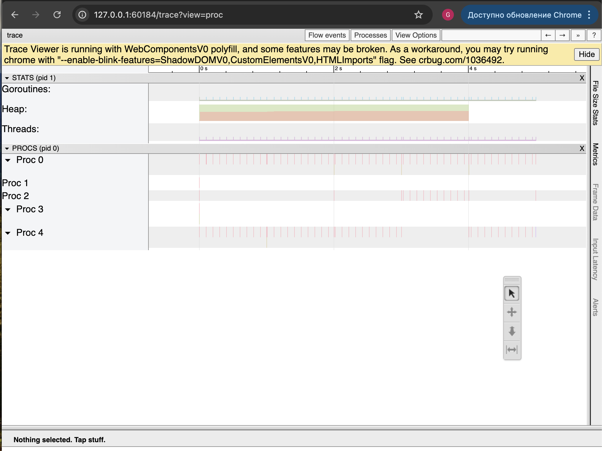
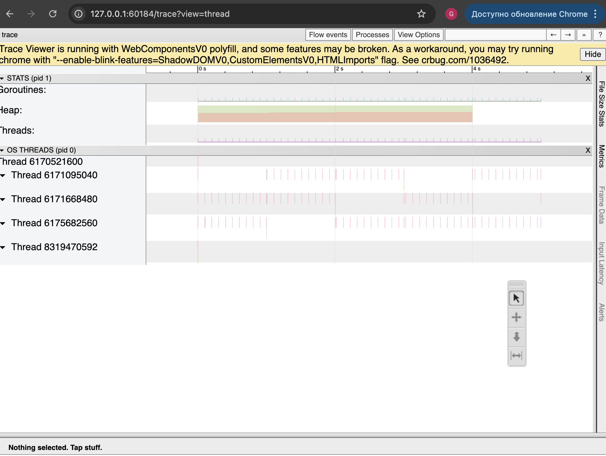
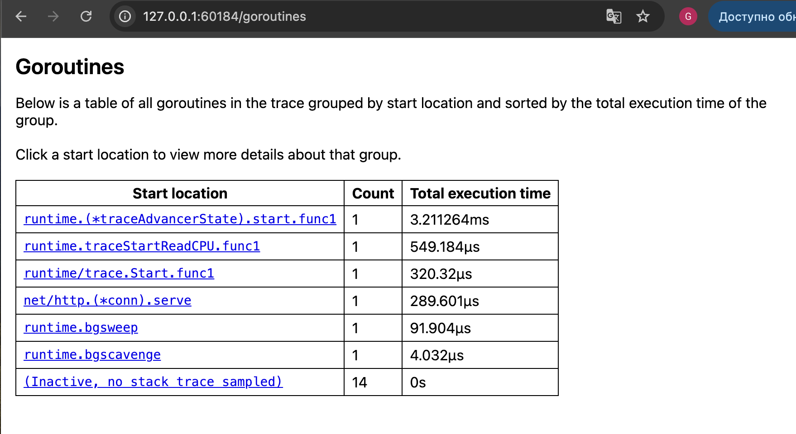
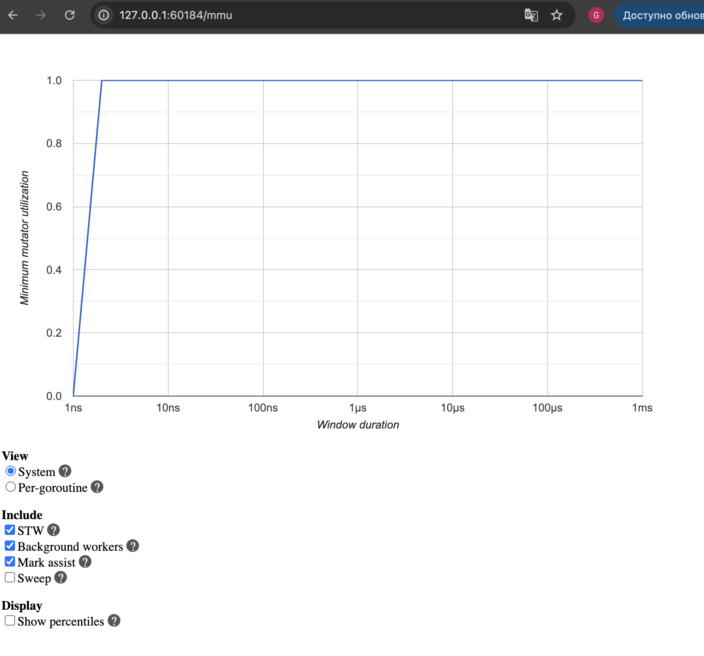
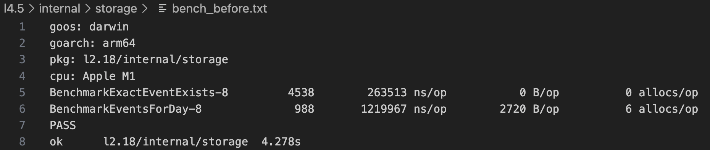
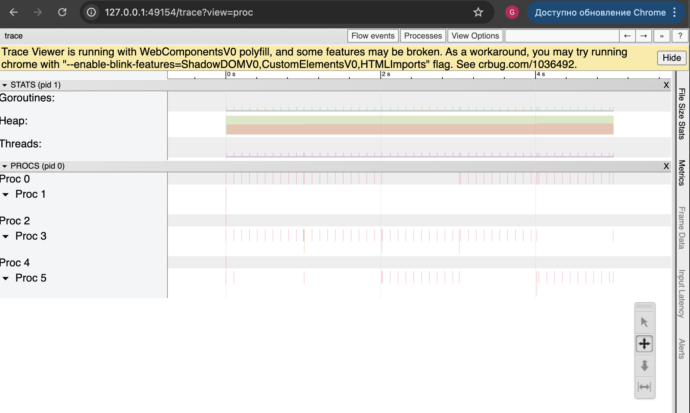
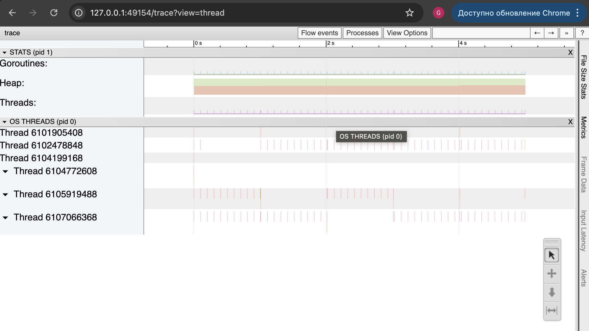
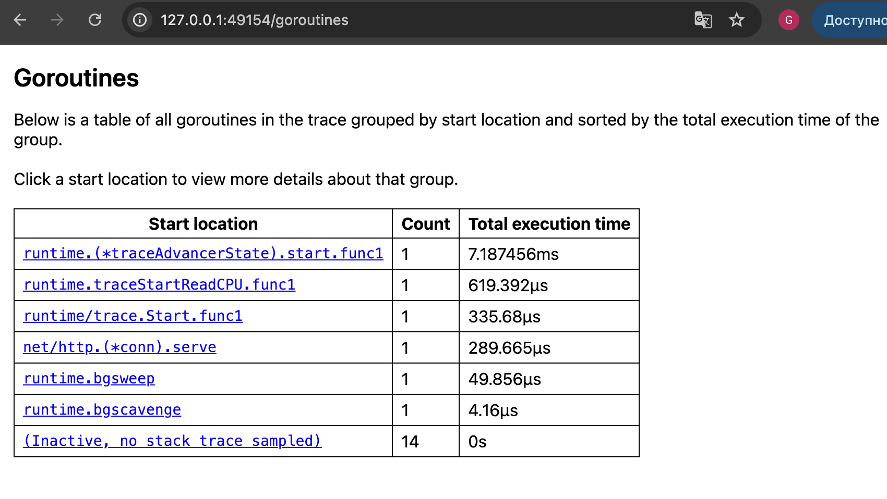
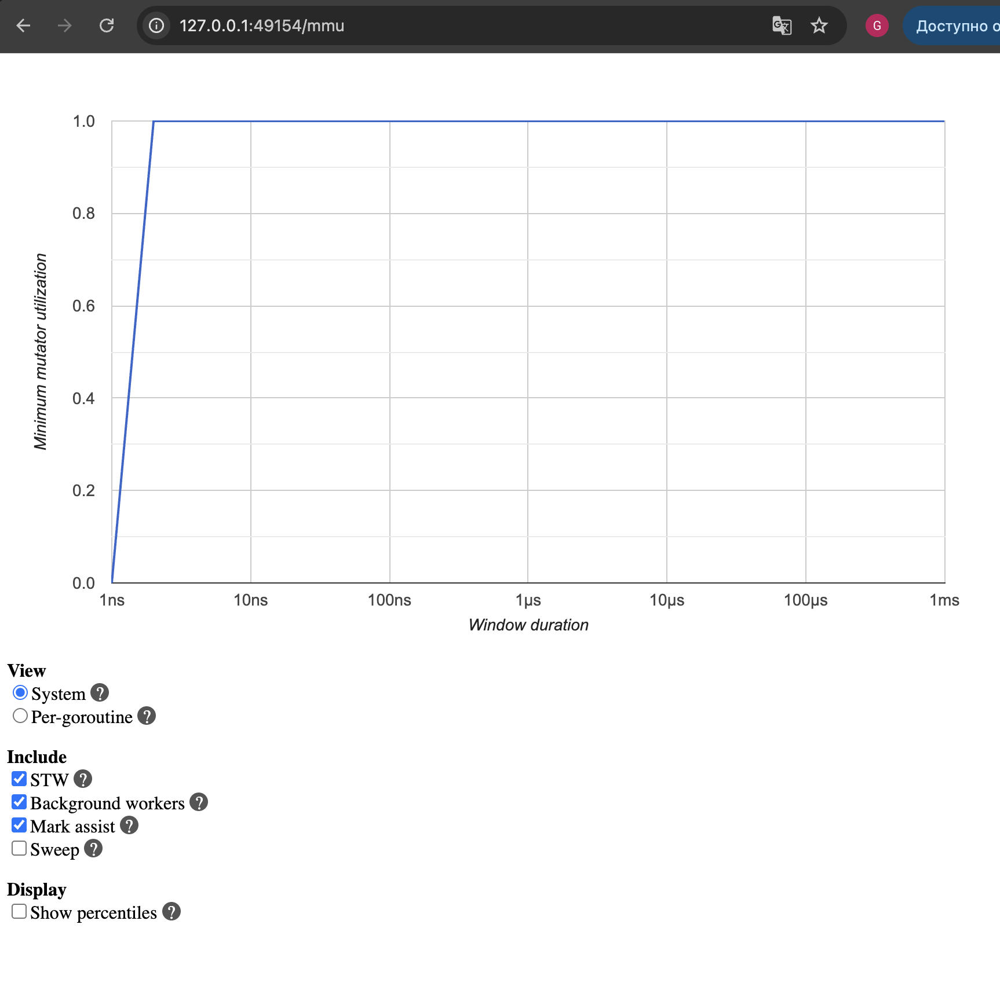
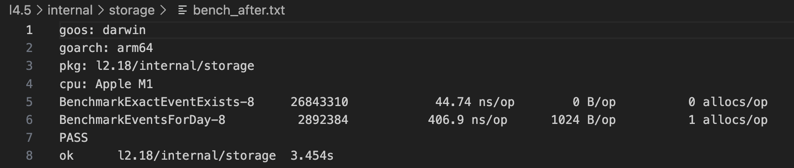

### Оптимизация простого API-сервиса с профилировкой

### **[Задание](./docs/task.md)**

### **[API-сервис](./docs/README.md)**

### До оптимизации
Добавил в исходный проект `_ "net/http/pprof"`
Создал нагрузку 
```sh
wrk -t4 -c128 -d30s http://localhost:8080/events_for_day?user_id=1&date=2024-01-01
```
Вывод 
```sh
Running 30s test @ http://localhost:8080/events_for_day?user_id=1&date=2024-01-01
  4 threads and 128 connections
  Thread Stats   Avg      Stdev     Max   +/- Stdev
    Latency     1.58ms    1.61ms  62.70ms   92.39%
    Req/Sec    21.99k     3.71k   43.20k    85.58%
  2626633 requests in 30.04s, 475.94MB read
  Non-2xx or 3xx responses: 2626633
Requests/sec:  87437.73
Transfer/sec:     15.84MB
```
значение CPU профиля
```sh
go tool pprof http://localhost:6060/debug/pprof/profile?seconds=20
(pprof) top
Showing nodes accounting for 30ms, 100% of 30ms total
Showing top 10 nodes out of 22
      flat  flat%   sum%        cum   cum%
      10ms 33.33% 33.33%       10ms 33.33%  runtime.(*unwinder).resolveInternal
      10ms 33.33% 66.67%       10ms 33.33%  runtime.kevent
      10ms 33.33%   100%       10ms 33.33%  runtime.pthread_cond_wait
         0     0%   100%       10ms 33.33%  runtime.(*unwinder).init (inline)
         0     0%   100%       10ms 33.33%  runtime.(*unwinder).initAt
         0     0%   100%       20ms 66.67%  runtime.findRunnable
         0     0%   100%       10ms 33.33%  runtime.gcBgMarkWorker
         0     0%   100%       10ms 33.33%  runtime.gcBgMarkWorker.func2
         0     0%   100%       10ms 33.33%  runtime.gcDrain
         0     0%   100%       10ms 33.33%  runtime.gcDrainMarkWorkerDedicated (inline)
```
значение Memory профиля
```sh
go tool pprof http://localhost:6060/debug/pprof/heap
(pprof) top
Showing nodes accounting for 1539.05kB, 100% of 1539.05kB total
Showing top 10 nodes out of 14
      flat  flat%   sum%        cum   cum%
     514kB 33.40% 33.40%      514kB 33.40%  bufio.NewWriterSize (inline)
     513kB 33.33% 66.73%      513kB 33.33%  runtime.allocm
  512.05kB 33.27%   100%   512.05kB 33.27%  runtime.(*scavengerState).init
         0     0%   100%      514kB 33.40%  net/http.(*conn).serve
         0     0%   100%      514kB 33.40%  net/http.newBufioWriterSize
         0     0%   100%   512.05kB 33.27%  runtime.bgscavenge
         0     0%   100%      513kB 33.33%  runtime.mstart
         0     0%   100%      513kB 33.33%  runtime.mstart0
         0     0%   100%      513kB 33.33%  runtime.mstart1
         0     0%   100%      513kB 33.33%  runtime.newm
```

значение Trace профиля
```sh
curl -o trace.out http://localhost:6060/debug/pprof/trace?seconds=5
% Total    % Received % Xferd  Average Speed   Time    Time     Time  Current
                                 Dload  Upload   Total   Spent    Left  Speed
100 28163    0 28163    0     0   5626      0 --:--:--  0:00:05 --:--:--  6071
```
```sh
go tool trace trace.out
```
View trace by proc
<p align="center">  </p>

View trace by thread
<p align="center">  </p>

Goroutine analysis
<p align="center">  </p>

Garbage collection metrics
<p align="center">  </p>

Запускаю бенчмарк для `storage.go`, чтобы сравнить результаты до и после оптимизации. 
```sh
go test -bench=. -benchmem > bench_before.txt
```

Результат
<p align="center">  </p>

---

### После оптимизации
в файле `storage.go` была изменена структура хранения событий на `events map[int]map[int64]map[string]model.Event`, что позволило сократить время выполнения CRUD-операций с `O(n)` до `O(1)` для большинства случаев и значительно ускорило ответы API.

Создаем нагрузку
```sh
wrk -t4 -c128 -d30s http://localhost:8080/events_for_day?user_id=1&date=2024-01-01
```
Вывод
```sh
Running 30s test @ http://localhost:8080/events_for_day?user_id=1&date=2024-01-01
  4 threads and 128 connections
  Thread Stats   Avg      Stdev     Max   +/- Stdev
    Latency     1.51ms    1.20ms  28.30ms   63.74%
    Req/Sec    22.32k     2.93k   36.23k    87.58%
  2665939 requests in 30.03s, 483.06MB read
  Non-2xx or 3xx responses: 2665939
Requests/sec:  88777.05
Transfer/sec:     16.09MB
```

значение CPU профиля
```sh
go tool pprof http://localhost:6060/debug/pprof/profile?seconds=20
(pprof) top
Showing nodes accounting for 20ms, 100% of 20ms total
Showing top 10 nodes out of 17
      flat  flat%   sum%        cum   cum%
      10ms 50.00% 50.00%       10ms 50.00%  runtime.(*mspan).heapBitsSmallForAddr
      10ms 50.00%   100%       10ms 50.00%  runtime.pthread_cond_signal
         0     0%   100%       10ms 50.00%  runtime.(*mspan).typePointersOfUnchecked
         0     0%   100%       10ms 50.00%  runtime.gcBgMarkWorker
         0     0%   100%       10ms 50.00%  runtime.gcBgMarkWorker.func2
         0     0%   100%       10ms 50.00%  runtime.gcDrain
         0     0%   100%       10ms 50.00%  runtime.gcDrainMarkWorkerDedicated (inline)
         0     0%   100%       10ms 50.00%  runtime.mcall
         0     0%   100%       10ms 50.00%  runtime.notewakeup
         0     0%   100%       10ms 50.00%  runtime.park_m
```         

значение Memory профиля
```sh
go tool pprof http://localhost:6060/debug/pprof/heap
(pprof) top
Showing nodes accounting for 2052.05kB, 100% of 2052.05kB total
Showing top 10 nodes out of 18
      flat  flat%   sum%        cum   cum%
    1026kB 50.00% 50.00%     1026kB 50.00%  runtime.allocm
     514kB 25.05% 75.05%      514kB 25.05%  bufio.NewReaderSize (inline)
  512.05kB 24.95%   100%   512.05kB 24.95%  runtime.(*scavengerState).init
         0     0%   100%      514kB 25.05%  bufio.NewReader (inline)
         0     0%   100%      514kB 25.05%  net/http.(*conn).serve
         0     0%   100%      514kB 25.05%  net/http.newBufioReader
         0     0%   100%   512.05kB 24.95%  runtime.bgscavenge
         0     0%   100%      513kB 25.00%  runtime.findRunnable
         0     0%   100%      513kB 25.00%  runtime.injectglist
         0     0%   100%      513kB 25.00%  runtime.injectglist.func1
```
значение Trace профиля
```sh
curl -o trace.out http://localhost:6060/debug/pprof/trace?seconds=5
  % Total    % Received % Xferd  Average Speed   Time    Time     Time  Current
                                 Dload  Upload   Total   Spent    Left  Speed
100 28201    0 28201    0     0   5635      0 --:--:--  0:00:05 --:--:--  6094
```
```sh
go tool trace trace.out
```
View trace by proc
<p align="center">  </p>

View trace by thread
<p align="center">  </p>

Goroutine analysis
<p align="center">  </p>

Garbage collection metrics
<p align="center">  </p>

Запускаю бенчмарк для `storage.go`, чтобы сравнить результаты до и после оптимизации. 
```sh
go test -bench=. -benchmem > bench_after.txt
```

Результат
<p align="center">  </p>


### ВЫВОД
После оптимизации структуры данных в `storage.go` (переход от линейного слайса событий к иерархической карте
`map[int]map[int64]map[string]Event`) производительность сервиса значительно улучшилась.

**Резкое ускорение CRUD-операций**

Бенчмарки показали сокращение времени работы на 4–5 порядков:
| Операция         | До (ns/op) | После (ns/op) | Ускорение |
|------------------|------------|---------------|-----------|
| ExactEventExists | 263 513    | 44.7          | ~6000×    |
| EventsForDay     | 1 219 967  | 406           | ~3000×    |


Это объясняется тем, что поиск перестал быть линейным (O(n)) и стал хеш-доступом (O(1)).

**Снижение нагрузки на GC и уменьшение аллокаций**
- EventsForDay уменьшил аллокации с 6 → 1 и объём с 2720 B → 1024 B.
- Переход к map устранил постоянные копирования и расширения слайсов.
- В профиле heap заметно уменьшился процент памяти, выделяемой под структуры слайсов.

**Снижение конкуренции за мьютексы и блокировок**
- было большое количество goroutines в состоянии ожидания

После оптимизации:
- блокировки локализованы на уровне конкретного дня и конкретного события;

**Более стабильная работа сервера под нагрузкой**

Даже при одинаковой нагрузке `wrk -t4 -c128 -d30s` улучшения видны:
| Параметр          | До       | После    |
|-------------------|----------|----------|
| Средняя latency   | 1.58 ms  | 1.51 ms  |
| Max latency       | 62 ms    | 28 ms    |
| StdDev            | 1.61 ms  | 1.20 ms  |

Сервер отвечает быстрее

### **Заключение**

Оптимизация структуры хранения:
- убрала линейные проходы;
- уменьшила количество аллокаций и давление на GC;
- снизила конкуренцию потоков;
- стабилизировала время отклика API под высокими нагрузками;
- дала ускорение операций в 3000–6000 раз на уровне хранилища.

Таким образом, оптимизация storage стала ключевым фактором роста производительности всего API-сервиса.